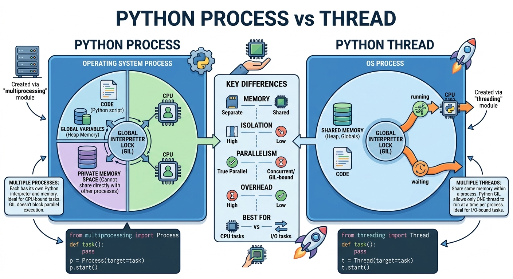

# Process
`Processo` é um programa em execução. Cada processo tem:
- Memória: separada;
- Comunicação: difícil;
- Criação: Pesada;
- Isolamento: Alto.

`Multiprocess` ajuda em atividades **CPU-bound** pois aqui o **GIL** não trava o processamento, o paralelismo aqui é real.

*curiosidade*: Em python para `multiprocess` o Python serializa o código para depois deserializar no processo respectivo. Funções anonimas como *lambda functions* não são serializaveis e por conta disso tomamos `error` ao tentar usar threads ou processos em um código que possui essas funções no código.

